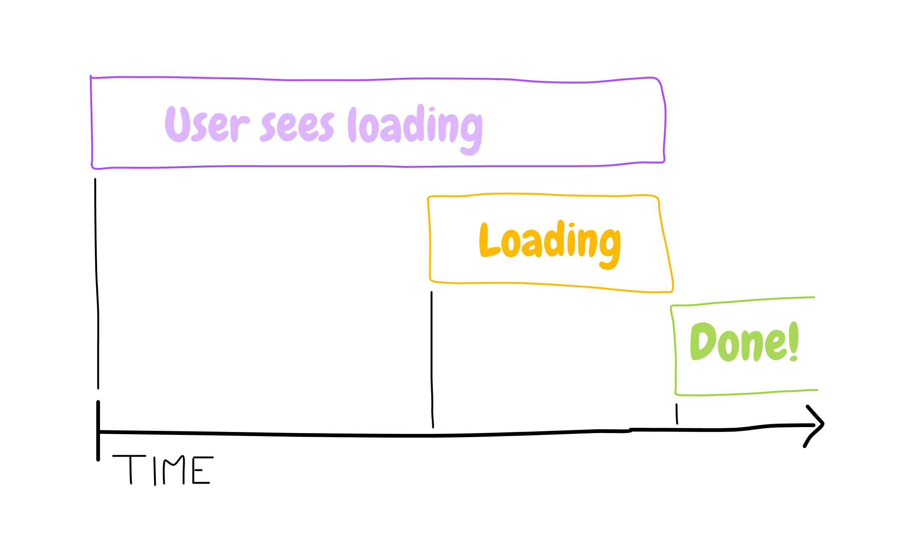
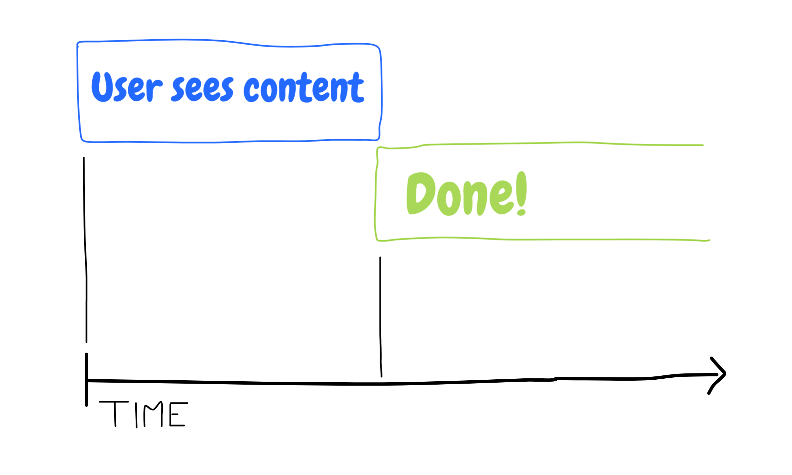
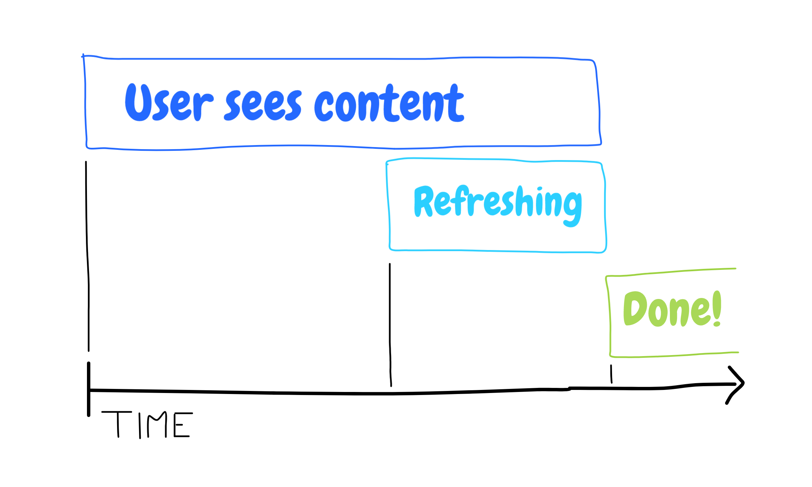

+++
title = "Web app rendering 101"
date = 2021-08-26

[taxonomies]
tags = ["code", "web"]
+++

I've encountered many people being oblivious to the way web application
rendering works. Initial rendering is an important topic, especially in the
context of **SEO** and **performance**, so brew yourself a nice cup of tea and
pay attention.

Now, I will be talking about **customer-facing web apps**. When building
internal tools or toy apps, it does not really matter. Just pick whichever is
the simplest to implement (which is CSR in most cases).

There are _three_ stages of the initial app render:

1. **Initial markup** is what user sees while scripts load and start up
2. **Loading state** refers to the state when actual data is being fetched after
   the app has bootstrapped
3. **Loaded content** is when all data is loaded and the app is ready to use

Each approach solves the individual steps and their transitions slightly
differently, with different nuances and trade-offs.

## Client-side rendering

Aka **CSR**.

The client is served a plain HTML file that only contains meta tags, script and
style links. The element where the app is rendered is empty, as such:

```html
<div id="app"></div>
```

The initial page is usually blank, maybe with customized background color. The
initial rendering flow looks like this:


As the _initial markup_, the user sees nothing. After the initial mount, they
see a _loading state_ of the application while data is being fetched. Only after
that do they see the actual _loaded content_.

The summarized flow:


Since the rendering is only happening on the client, you can get away with all
kinds of wild and disgusting things, like accessing `window` all over the place,
global state, side effects affecting the rendered markup, etc.

Just remember — just because you _can_, does not mean you _should_. In fact, you
really should not. :smile: Follow best practices at all times. With everything.
Stop feeling sorry for your lazy ass.

Pros:

- Very easy to implement
- No need for a server
- Quick and simple build stage

Cons:

- User sees nothing for a long time
- Two loading stages — an empty page and a loading skeleton
- Terrible SEO :vomiting_face:
- No need to follow best rendering practices

## Server-side rendering

Aka **SSR**.

The server renders the HTML for the initial app render together with populating
all the SEO goodies. There are two types of SSR:

- render the plain page skeleton
- fetch data first, then render the whole app with content

There is one rule for all SSR that will make your life a lot easier. Bear with
me. :bear: That rule is — your server rendering function is a function of the
URL, maybe locale, maybe theme, and nothing else!

The main reason for this is avoiding locking yourself into needing the server.
If you _need_ the server to do a whole bunch of stuff, it will become a
humongous pain in the ass to maintain it, and you lock yourself out of static
rendering.

Remember, all you really need for rendering your markup is:

- the URL
- locale, if you have different locales
- theme, if you have themes

If possible, defer all other rendering conditions, like the choice of currency
or geo stuff, to the client. It is a minimal UX compromise for a drastic
reduction in complexity! :gem:

### Plain

This one I like to call a _waste of a good server_. All the server does is
rendering a loader skeleton for every possible URL. The initial render looks
like this:


The user immediately sees a loader skeleton of the webpage as the _initial
markup_. The initial mount is identical with the provided HTML, so the user
seamlessly transitions into the _loading state_. User is displayed _loaded
content_ when it finishes fetching.



The reason why this approach is a waste is that the server _plays no role at
all_. It literally just re-renders the same thing all over again. :sweat_smile:
Might as well pre-render everything and serve static files.

Pros:

- User immediately sees something
- Seamless initial to loading state transition
- _Some_ SEO

Cons:

- Wasteful server work
- User still waits for content
- Mediocre SEO

### With content

This is the holy grail of SEO and performance. It does not get better than this
UX-wise! :exploding_head:

SSR done with data fetching is the Lamborghini Urus of web app renderings. It
has it all, but costs a fucking fortune, both initially and maintenance-wise.
:money_with_wings:

The user is served with _initial markup_ already hydrated with content, so no
_loading state_ is present at all. The app transitions seamlessly into the
_loaded content_ state after its bootstrap:


Server-to-server communication is _much_ faster than client-to-server, so the
initial data is fetched very quickly. In addition, the lack of loading state on
the client makes the app ready to use super fast:



"C'mon, there has to be some caveat to this approach! :grimacing:" You might
say. And you're right. A slow backend could delay TTFB, which would delay the
initial render. In addition, you need a server, and a damn complex at that. On
top of that, getting data serialization and hydration working is quite tedious
and prone to errors.

Here is a typical flow for a single request:

1. Collect necessary data requirements of the request
2. Fetch the data from the server
3. Render markup with the fetched data
4. Serialize data and embed them into the HTML
5. On the client, deserialize data and supply them to the initial render
6. Bulletproof the initial render to be 100% consistent with the server render
7. Use the data from the server and avoid double-fetching :hot_face:

So go ahead, whip out your fancy dancy SSR with content going on, just make god
damn sure you can handle it!

Pros:

- Godlike UX
- Top performance
- Perfect SEO
- Server-side data fetching

Cons:

- Insane complexity! :fire:
- Gotta have a server

## Static rendering

CSR is the thing you _have_. SSR is the thing you _want_. Static rendering is
the thing you _need_.

Let me spill the beans real quick — there are only two types of viable rendering
options:

1. SSR with data fetching
2. Static rendering, with or without content

In the vast majority of cases, static rendering is the answer. Be honest with
yourself — do you really need a Lamborghini Urus? Or is an X5 completely
sufficient? :thinking:

While some people really _do_ need the Urus going on, for lobbing purposes for
example. But that's a _tiny fraction_ of the population. Same goes for SSR with
data fetching!

Static rendering is simple, cheap, robust and overall offers the best
price-to-performance ratio of all the other options.

So what is static rendering anyway? :smile:

After your app is compiled, you run your pre-rendering script, which renders a
HTML page for every static URL your app has. These pre-rendered pages are then
served to your users as static files, together with an optional `200.html`
fallback page, or a `404.html` page, in case the requested URL is not
pre-rendered.

### Plain

For every URL your app has, a loader skeleton is statically rendered. The UX is
basically identical to the one of plain SSR:


The user receives a loader skeleton as the _initial markup_. This seamlessly
transitions into the _loading state_ of the app. User is displayed _loaded
content_ when it finishes fetching.


If your content is private for users, or you have highly dynamic content and
favor simplicity over optimization, this is the approach for you. :ok_hand:

Pros:

- No server! :tada:
- Simple to implement and maintain
- User immediately sees something
- Seamless initial to loading state transition
- _Some_ SEO

Cons:

- User still waits for content
- Mediocre SEO

### With content

If possible, doing static rendering with content is the **absolute best option**
out of them all, period. The only requirement is that your content must be
rather static, meaning it changes once every couple of days maximum. Think
training plans, marina listings, or the like.

In most cases, the UX is the same as with SSR with content:


The initial data is readily available, but can be stale, so is re-fetched on the
client to ensure freshness. The app is already usable while the data is
refreshing, so the whole experience is super fast! :fire:



The build process is quite more involved than plain static rendering. The
pre-rendering build stage involves four kinds of renderings:

- fallback pages like `200.html` or `404.html`
- static URLs with content, like `/about`
- loading skeleton for dynamic fallback URLs, like `/program/:id`, in case `:id`
  is not pre-rendered
- dynamic URLs with content, like `/program/1337`, with the full list fetched
  from the server

The routing also needs a bunch of rewrite rules so that a missing `/program/:id`
gets served the proper loading skeleton and not a `200.html` page.

Another great thing about this approach is the possibility to upgrade to a full
SSR if the need arises with ease. Since you already have a function for
rendering markup hydrated with content, you just hook it up to a server instead
of pre-rendering stuff statically.

Pros:

- No server! :tada:
- Simple to implement and maintain
- Godlike UX
- Awesome performance
- Close to perfect SEO
- Static data fetching
- Easy migration to full SSR

Cons:

- Needs a bunch of rewrite routing rules
- Complex build step

## Summary

So, that was a lot. :grin: Just remember:

- do static rendering as the default, full with less dynamic content, and plain
  with more dynamic content
- do full SSR if you want the absolute best performance and UX and give zero
  fucks about anything else

Cheerio! :wave:
