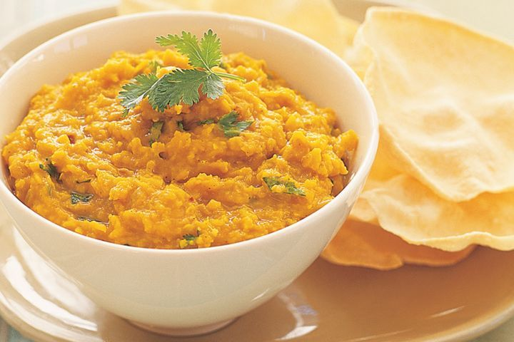

+++
title = "Dhal"
date = 2022-01-13

[taxonomies]
tags = ["food", "health"]
+++

This is my **dhal** recipe, simplified for my meal prep needs. A great gut
health food!

# Ingredients

- 4 larger onions, roughly chopped
- 3 larger garlic cloves, finely chopped
- thumb-sized peeled ginger, grated
- 6 tbsp ghee / vegetable oil
- 1 tsp ground coriander
- 1 tsp ground cumin
- 1 tsp ground mustard seeds
- 2 tsp garam masala powder
- 4 tbsp turmeric powder
- 2 tbsp table salt
- 3-4 large cayenne chillies, chopped
- 1000ml vegetable broth
- 800g canned tomatoes
- 800ml coconut milk
- 500g red lentils

# Process

Heat up the _fat_ in a deep frying pan. Fry the _onions_, _garlic_ and _ginger_
until softened.

Throw in all the _spices_ and _salt_, fry for about a minute. Add the _broth_,
_tomatoes_, _coconut milk_, _chillies_ and _lentils_.

Let it simmer with an occasional stir until the mixture is thicc, about
20-25min.

# Serving

Serve with basmati rice, garnish with coriander and yogurt.
