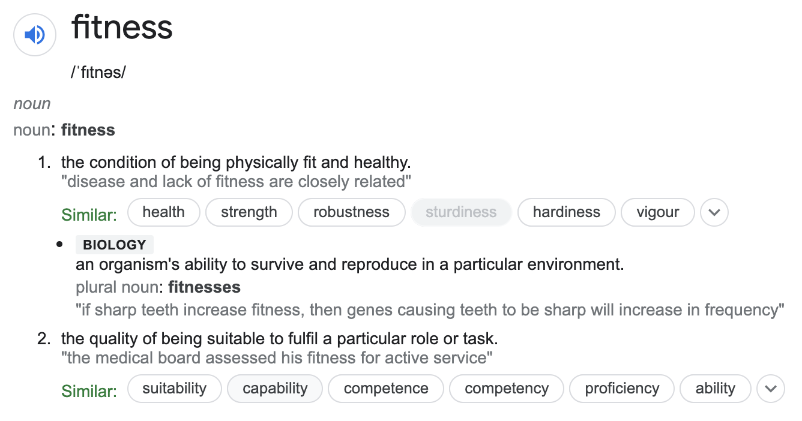

+++
title = "The math of fitness"
date = 2021-12-13
draft = true

[taxonomies]
tags = ["gains", "health"]
+++

_Fitness_ is one of the most bastardized terms in the industry. No one really
knows what does the word mean. Some interpret it as low-enough body fat. Others
consider people with great endurance to be fit, such as marathon runners.
Strength and muscle is often an indicator of fitness as well. The list goes on.

I am going to offer a mathematical interpretation of fitness, along with
practical implications that arise in context of life and sport performance.
These ideas are not new. In fact, Greg Glassman, founder of CrossFit, has talked
about this interpretation multiple times during his presentations[^1]. I want to
build upon his ideas and introduce a robust framework for _training for a better
life_.

# Definition

If you search for the term "fitness", you get a bunch of definitions:



The first definition, "the condition of being physically fit and healthy" is
ambiguous — how should one interpret "fit"? Most people will give completely
different answers.

The second definition, "the quality of being suitable to fulfil a particular
role or task" is more interesting. Applying it on the prior definition, we can
define "fit" as "being physically able to function in life".

This means that a person can list tasks they want to be able to perform, then
gauge their _fitness_ based on their performance executing said tasks. For
example, one may want to:

- do some household stuff like organize items, carry suitcases to the car
- play with their kids, toss them around, participate in outside games
- do leisure sports such as snowboarding, hiking, bowling
- do intellectual activities for relaxation

For this person, fitness means being able to perform these actions with ease,
ideally into a very old age. They want to be productive at their job, lead an
active lifestyle with family and friends and still have some energy left for
books and video games in the evening.

# Abstraction

Consider the following activities:

- running, swimming, cycling
- snatch, clean, jerk, squat, press, deadlift
- carrying a suitcase, placing bricks on top of each other
- cooking, cleaning, chasing a toddler

What exactly happens when we perform these activities? What do they have in
common? In cycling, we're pressing pedals at a certain pace. When carrying a
suitcase, we're moving objects through space. Placing bricks involves lifting
and moving objects. Chasing a toddler is basically lifting an object and
running. Household chores involve a lot of item micromanagement. Snatch and
those other lifts involve displacing a heavy ass weight.

You may start noticing a pattern here. Moving and lifting objects, pressing
pedals, running. They all involve _doing work_ within a certain _time_, either
via exerting force for a certain distance by grabbing and moving an object or
moving feet, or even just spending energy by performing certain tasks like
stirring soup.

Doing **work** within a certain **time** is in fact the formula for **power**:

```
TODO draw and graph this:
P = dW / dt
```

As we established previously, a fit person has the ability to _perform his
desired tasks_. In other words, they're able to _produce enough power for the
given period of time_ in the _context_ of the task.

## Work capacity

How do we optimize our ability to perform the tasks we want, participate in
sports, thus increase our "fitness"? With power being the common variable, we
want to be able to _exert as much power as possible for a certain period of
time_ in a specific context. In other words, we want to be able to _perform as
much work as possible within a time frame_.

In the following section, I am going to intentionally disregard context
specificity for a while. Doing so will allow me to put clear focus on the
abstract idea I want to present. Context specificity will be reintroduced later
when we'll start bringing focus back to practical implications.

Consider the following formula that calculates **work** done by exerting
**power** over a period of **time**:

```
TODO draw and graph this:
W = t=0_int^T P(t) * dt
```

For a specific time `T`, in order to maximize work capacity `W`, we have to
maximize the _area under the curve_ of the graph. That means maximizing average
power `P` within the time.

The amount of work we can produce within a certain time is our _work capacity_
for that time frame.

## Work spectrum

Maximizing work capacity in just a single time frame is very limiting. We want
to maximize our work capacity across a _broad time domain_. Going up a
dimension, we can illustrate a _spectrum of work capacities_, which is the
volume under the plane formed by _work capacities of different time frames_. I
am going to call it _work spectrum_:

```
TODO draw and graph this:
WS = s=0_int^S t=0_int^s P(t, s) * dt
```

Within the time domain from zero to `S` we calculate our _work capacity_ in each
time frame. To maximize the _volume under the plane_ of the graph we have to
maximize the average power `P` for each time frame.

## Context specificity

The established _work spectrum_ formula assumes a seamless carryover between
contexts, meaning that having a certain work capacity in one context means
having the same capacity in all contexts. This assumption, however, violates the
rule of context specificity[^2].

Adding a _broad spectrum of contexts_ to the formula finally gives us the
mathematical representation of **fitness**:

```
TODO draw and graph this:
Fitness = i=0_sum^n s=0_int^S t=0_int^s P(t, s, Ci) * dt
```

For each context `Ci`, we calculate _work capacity_ for that context in a broad
time domain from zero to `S`. To maximize _fitness_, we have to maximize _volume
under the plane_ for each context's _work spectrum_, meaning we have to maximize
the average power `P` for each time frame in each context.

As Glassman said it[^3]:

> Fitness is work capacity measured across broad time and modal domains.

This means that when we are improving our fitness, we're improving our ability
to execute _every possible task_ in a _broad time domain_, be it running,
lifting or carrying stuff, chores, babysitting, building a house. You name it.

# Buffering

One may wonder, why should we _maximize_ our fitness? Isn't being _fit enough_
to be able to do our intended tasks sufficient?

The short answer is **no**. We'll go through reasons why we want to _buffer_ as
much fitness as possible, as soon as possible.

## Aging

As humans age, we lose power[^4], strength[^5] and endurance[^6], all direct
components for power production over a period of time, in a %-based manner. This
implies that our _power across every age_ function is _continuous_:

```
TODO draw
^ power
| -\
____> age
```

This loss of power directly affects the formula for _fitness_, because we
gradually lose the ability to _produce power in all contexts and across the
whole time domain_. Graphing a person's fitness across his life very much
resembles the declining power function:

```
TODO
^ fitness
| -\
____> age
```

Let's assume a curve of a person's desired _minimal fitness_, indicating how fit
this person wants to be at a given age. This can for example mean that an
elderly person wants to be able to play with his grandchildren, carry groceries,
hike and do gardening work on weekends. When younger, they also wanted to play
sports and compete, be productive at work and handle chores. Their minimal
fitness curve would look something like this:

```
TODO
^ fitness
| -\
| ---- curve
|    \
____> age
```

When their fitness falls fall under the curve, they lose the ability to perform
some of their desired activities, and the deeper they are, the more ability they
lose.

How do we ensure delaying falling under our personal minimal fitness curve?
Because losing fitness is gradual, the answer is simple — **buffer as much
fitness as possible**!

Consider two graphs for the same person. In one, they only trained their fitness
slightly. In the other, they tried to maximize their fitness the best their
lifestyle allowed them to:

```
TODO make two of these, one crosses at 45, one at 85
^ fitness
| -\
| ----- curve
|    \
_____> age
```

Notice how in the first graph, they cross their minimal fitness curve at around
the age of 45, while in the other graph they do so at 85. This means that
maximizing fitness allowed them to _live to their full potential for 40 more
years_!

While this is all presented using abstract math, the impact of fitness
improvements during aging is well-established[^7], including the benefits of
resistance training[^8][^9], aerobic and anaerobic training[^10][^11], and power
training[^12].

## Perceived exertion

Imagine having to carry a bunch of groceries across a huge parking lot at a mall
on a hot summer day. Heavy ass ones, with bottled water and a watermelon and
everything. The total weight being what you can barely handle. How tired would
you be after the trip? You'd probably be catching breath for a couple of
minutes, hands shaking, and sweating like a jazzman at midnight on live
television.

The work you performed was near your _work capacity_ in the context of this
grocery trip. Your _perceived exertion_ of this trip is inversely proportional
to how close the _total work done_ is to your _work capacity_ in this context.
Let's illustrate perceived exertion in percent using a graph of our power
output:

```
TODO
^ power
| ------- max power
| ------- performed power
|
|
---------> time

PE = W / W_max * 100%
   = ~90%
```

The perceived exertion `PE` is calculated as the total work done `W` over our
work capacity `W_max` in the given context and time frame, multiplied by `100`
to get the percent.

A commonly used ranking system is **Rating of Perceived Exertion**, or **RPE**
for short. For simplicity, an implementation that could be applied in our
example is simply transferring percent to a 1-10 numeric scale by rounding:

| Perceived exertion | RPE |
| ------------------ | --- |
| 0-14%              | 1   |
| 15-24%             | 2   |
| 25-34%             | 3   |
| ...                | ... |
| 75-84%             | 8   |
| 85-94%             | 9   |
| 95-100%            | 10  |

In our groceries example, let's say we performed around 9/10 work of our max
potential. This means our perceived exertion would be at _90%_, or _RPE 9_.

Now imagine a second scenario where the groceries would be 1/3 of the weight we
can handle. You'd probably just casually walk to your car, put them there,
started your car and drove off home. The graph of your power output would look
like this:

```
TODO
^ power
| ------- max power
|
|
| ------- performed power
---------> time

PE = W / W_max * 100%
   = ~30%
```

Suddenly our perceived exertion of carrying groceries drops from RPE 9 to RPE 3.

You may wonder, how do we go about lowering our RPE, if we actually need to
carry all the heavy groceries? Well, simply by **increasing our work capacity**!
We cannot make groceries lighter, but we can _become stronger_ so that the
groceries _seem lighter to us_.

Same goes for grandparents chasing their grandchildren around — increasing their
endurance makes playing with kids much easier by dropping RPE significantly,
allowing grandparents to play longer, recover faster and literally making the
whole experience much more enjoyable.

Improving fitness literally _makes living life easier_. Tasks tire you less
short-term[^13] and you accumulate less fatigue in general[^14]. Your baseline
energy levels will improve[^15]. You literally drop your life RPE by **buffering
your fitness**!

Again, evidence about buffering fitness goes beyond math and RPE. Increased
energy levels happen at the cellular level by improving mitochondria
health[^16][^17], and that is achieved by training[^18]. There's even a
study[^19] confirming that the _more exercise you can do and recover from the
better_, even at top intensities (particularly for women).

# Implications

Now that we established the _formula for fitness_ and why we want to _maximize
fitness_, we're going to bring the abstract idea that was presented back to
earth, focusing on specifics of human movement and development.

## Foundation

There are ten commonly recognized fitness domains[^20], split into five
_physical_ and five _neurological_ domains.

The _physical_ domains cause alterations in body tissues when developed:

1. Endurance - Performing an activity for an extended period of time
2. Stamina - Performing an activity for a period of time at maximal effort
3. Strength - Force production in a given context
4. Flexibility - Maximizing range of motion of a joint
5. Power - Applying maximum force in minimum time

The _neurological_ domains are purely skill-based:

6. Speed - Minimizing time cycle of a repeated movement
7. Coordination - Combining movement patterns to a single movement
8. Agility - Minimizing transition time from one movement pattern to another
9. Balance - Controlling the body's center of gravity in relation to its support
   base
10. Accuracy - Controlling movement in a given direction or intensity

While everybody strives for at least _some_ level of competence in all of these
domains, the person's lifestyle and goals ultimately dictate the importance of
each one domain.

In addition, not all domains are created equal. Consider the formula for _work_
and _power_:

```
TODO
W = F * d
P = dW / dt
```

As you can see, work `W` is composed of _force production_ for a _distance_.
Power `P` is work done as quickly as possible. Work can also be expressed as
area under the curve of a function of _power_ for a certain _time_, as we did in
earlier chapters. Either way, to maximize work, we have to maximize _force_ and
_distance_, or maximize _time_ while maintaining _power_.

The four common variables in the formulae that we strive to maximize are:

- **Power** itself
- Force production, ergo **strength**
- Distance, ergo **endurance**
- Time while maintaining power, ergo **stamina**

These are what I call the _developmental fitness domains_, ones that we strive
to develop to their maximum at all times, as they are the ones that maximize our
fitness.

The rest of the fitness domains, that is flexibility, speed, coordination,
agility, balance and accuracy, are _elementary fitness domains_. Being
proficient enough in them is necessary to work on _developmental fitness
domains_ in an optimal and safe way. However, trying to maximize them brings
little to no benefit.

## Power curve

Choosing how to balance training individual developmental domains, as well as to
what extend should we work on elementary domains, is highly individual. There
are two general cases, however, that should be considered:

- Focused development for sport-specific needs
- Balanced development for improving everyday life

_Focused development_ means favoring one spectrum of time domain when developing
work capacity by focusing primarily on certain developmental domains, training
others only to a point that _does not interfere with their primary focus_.

For example, powerlifters focus on getting as _strong_ as possible,
weightlifters maximize their _power_. Both of these sports favor the very
beginning of the time domain, creating a steep power curve:

```
TODO
^ power
|\
| \______ str/pow
---------> time
```

On the contrary, long-distance runners and cyclists maximize _endurance_, which
develops the complete opposite of the time domain, thus creating a much flatter
curve:

```
TODO
^ power
|____      end
|    ----
---------> time
```

These athletes focus on their sport first and foremost. Anything else is
peripheral for them.

_Balanced development_ means splitting effort put into developmental domains in
a balanced way, maybe favoring some due to personal preference. This means
becoming sort of a _jack-of-all-trades_ if you will, being _good at everything_
yet _perfect at nothing_.

Instead of going all-in in one time spectrum and then just barely in the rest,
you focus on being proficient everywhere and filling gaps where they pop up,
creating a balanced power curve. This approach builds the most fitness —
maximizes work capacity across the time domain:

```
TODO
^ power
|-__
|   \--__ balanced
---------> time
```

Balanced development is ideal for improving everyday life, since you gather all
of the health benefits of all fitness domains, are able to perform all tasks at
a low RPE, and a cherry on top is that this approach builds, according to many,
the best physique possible! :fire:

# Training

_TODO actual training, how-to, why-to, training economy..._

## Movement patterns

_TODO_ choosing movement patterns based on goals, importance of variety,
choosing complexity. why powerlifts, weightlifts, strongman, gymnastics, odd
objects (sandbags, kettlebells), monostructurals

## Benchmarks

_TODO_ creating benchmarks from picked movements, scoring

## Phases

_TODO_ basic vs. strength & muscle, vs. conditioning & gymnastics, sports
specificity

[^1]:
    [Three Dimensional Definition of Fitness and Health](https://www.youtube.com/watch?v=Rl6ANK8CN5w)

[^2]:
    [Context Specificity in Performance](https://journals.sagepub.com/doi/abs/10.1177/154193129804201006?journalCode=proe)

[^3]:
    [Defining CrossFit](http://journal.crossfit.com/2010/12/glassmandefining.tpl)

[^4]:
    [Age-associated power decline from running, jumping and throwing](https://pubmed.ncbi.nlm.nih.gov/25724012/)

[^5]:
    [Strength and muscle mass loss with aging process](https://www.ncbi.nlm.nih.gov/pmc/articles/PMC3940510/)

[^6]:
    [Age-related alterations in muscular endurance](https://pubmed.ncbi.nlm.nih.gov/9587183/)

[^7]:
    [Anti-aging therapy through fitness enhancement](https://www.ncbi.nlm.nih.gov/pmc/articles/PMC2695180/)

[^8]:
    [Resistance training is medicine](https://pubmed.ncbi.nlm.nih.gov/22777332/)

[^9]:
    [Resistance training for health and performance](https://pubmed.ncbi.nlm.nih.gov/12831709/)

[^10]:
    [Health benefits of aerobic exercise](https://pubmed.ncbi.nlm.nih.gov/2062750/)

[^11]:
    [Aerobic vs anaerobic exercise training effects on the cardiovascular system](https://www.ncbi.nlm.nih.gov/pmc/articles/PMC5329739/)

[^12]:
    [High-speed power training in older adults](https://www.ncbi.nlm.nih.gov/pmc/articles/PMC3902133/)

[^13]:
    [Relationship between perceived exertion during exercise and subsequent recovery](https://www.ncbi.nlm.nih.gov/pmc/articles/PMC5377553/)

[^14]:
    [Increases in RPE Rating Predict Fatigue Accumulation](https://www.frontiersin.org/articles/10.3389/fphys.2021.735565/full)

[^15]:
    [Physical activity and feelings of energy and fatigue](https://pubmed.ncbi.nlm.nih.gov/16937952/)

[^16]:
    [Regulation and Dysregulation of Cellular Energy Supply and Metabolism](https://www.ncbi.nlm.nih.gov/pmc/articles/PMC7700424/)

[^17]:
    [Mitochondria-Fundamental to Life and Health](https://www.ncbi.nlm.nih.gov/pmc/articles/PMC4684129/)

[^18]:
    [Exercise and mitochondrial health](https://physoc.onlinelibrary.wiley.com/doi/10.1113/JP278853)

[^19]:
    [Accelerometer measured physical activity and the incidence of cardiovascular disease](https://journals.plos.org/plosmedicine/article?id=10.1371/journal.pmed.1003487#)

[^20]:
    [Foundations of CrossFit](http://journal.crossfit.com/2002/04/foundations.tpl)
